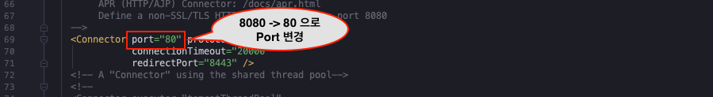
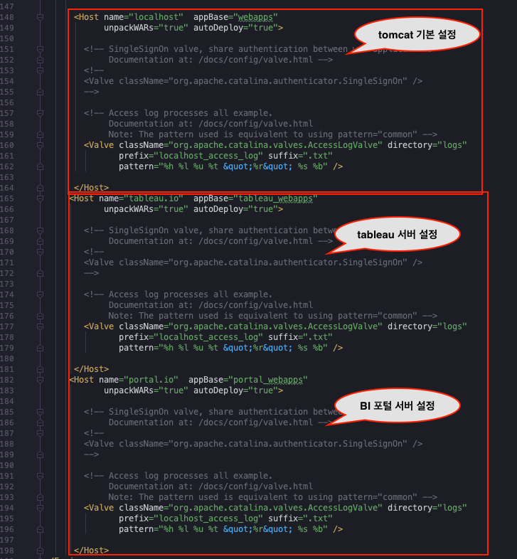

## Tomcat 가상 호스트 Configuration Sample
Mac에서 테스트 된 환경입니다, 설정 정보만 참고 해주세요.


## 테스트 환경
- Tomcat 8.5.41
-  Mac 또는 Linux 기반 OS 

## 테스트 방법
### Git Clone 
```
git clone https://github.com/hsquare-analytics/tomcat-virtual-host.git
```
### hosts 파일 수정
```
sudo vi /etc/hosts

#아래 IP 및 호스트명 추가  
127.0.0.1       portal.io
127.0.0.1       tableau.io
```
 
### tomcat start
```
~tomcat-virtual-host/libexec/bin/catalina.sh start
``` 

### 테스트 url 접근
```
http://tableau.io/
http://portal.io/
```
 
### 참고 파일
 - virtual host 설정
```
 ~tomcat-virtual-host/libexec/conf/server.xml
```
 - server.xml (port 변경)
<kbd></kbd><br />

 - server.xml (vhost 추가)
<kbd></kbd><br />

 - application 별 target directory
```
~tomcat-virtual-host/libexec/webapps/portal_webapps
~tomcat-virtual-host/libexec/webapps/tableau_webapps
```